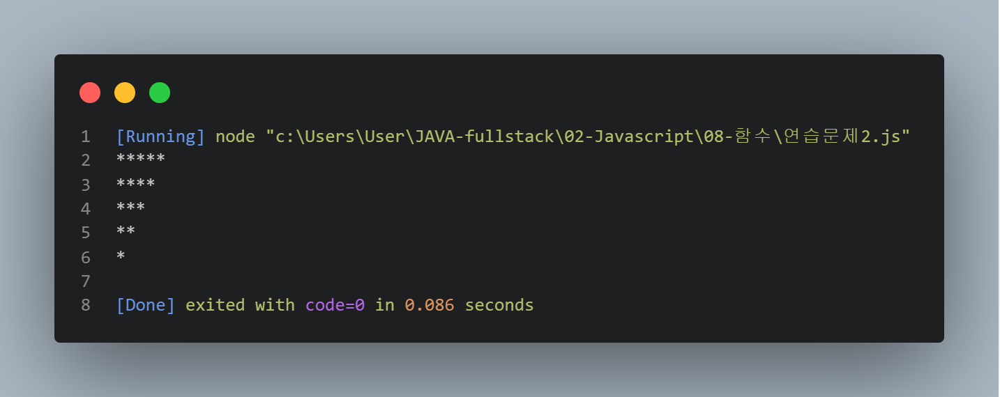
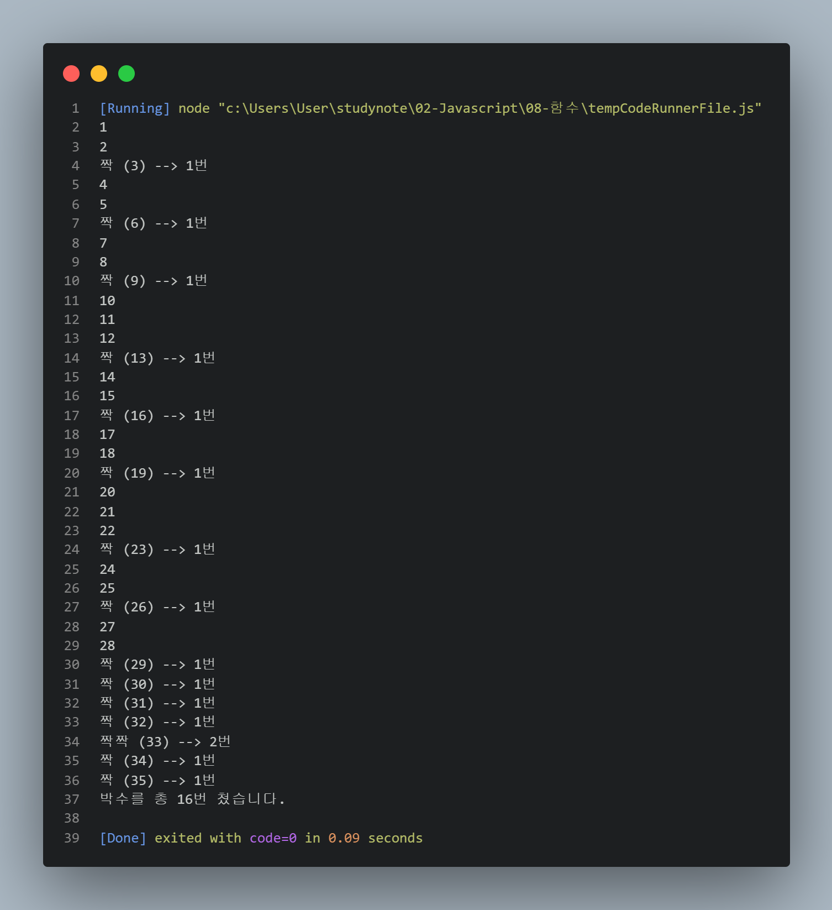
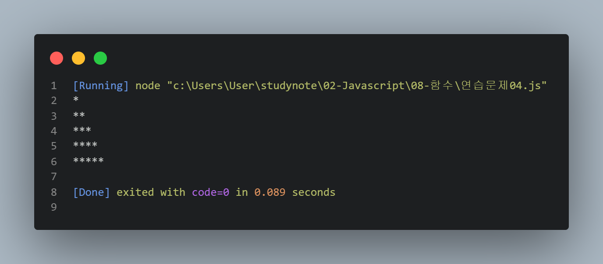
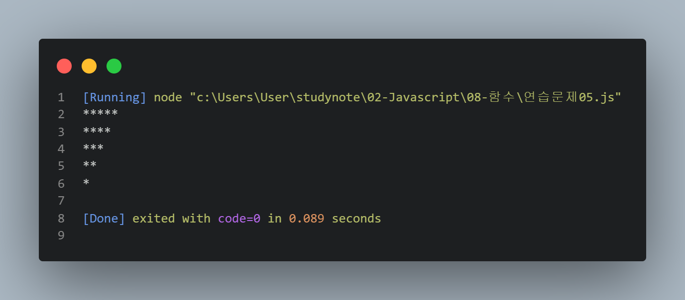

# 오현정 함수 연습문제

> 2022-02-07

## 문제1.

아래의 형태로 출력하는 재귀함수를 구현하시오.

```js
// max는 출력해야 할 최대 라인 수
// current는 현재 출력중인 라인의 위치
function printStar(max, current=1) {
    ... 구현하세요 ...
}

printStar(5)
```

#### 출력결과

```
*
**
***
****
*****
```

```javascript
// max는 출력해야 할 최대 라인 수
function printStar(max) {
    for (let i = 0; i < max; i++) {
        let str = "";
    
        for (let j = 0; j < i+1; j++) {
            str += "*";
        }
    
        console.log(str);
    }
}

printStar(5);
```


## 문제2.

1번 문제를 응용하여 같은 파라미터를 받았을 때 별을 역으로 출력하는 `printRevStar(max, current=1)` 을 구현하시오.


#### 출력결과

```
*****
****
***
**
*
```

```javascript
// max는 출력해야 할 최대 라인 수
function printRevStar(max) {
    for (let i = 0; i < max; i++) {
        let str = "";
    
        for (let j = 0; j < max-i; j++) {
            str += "*";
        }
    
        console.log(str);
    }
}

printRevStar(5);
```



## 문제3.

369게임은 숫자를 순서대로 말하면서 3,6,9가 포함된 횟수만큼 박수를 치는 게임이다.

1부터 파라미터로 전달된 숫자까지 반복하면서 박수를 칠 조건이 충족되면 3,6,9 게임 규칙에 따라 박수를 의미하는 "짝"을 출력하고 그렇지 않은 경우에는 숫자를 출력하고, 박수를 총 몇번 쳤는지를 리턴하는 함수 `myGame(n)`을 작성하시오.

힌트: 문자열은 그 자체가 배열로 인식됩니다.

ex)
```js
const str = "Hello";
console.log(str[0]); // --> H
console.log(str[1]); // --> e
console.log(str[2]); // --> l
```

#### 출력예시

myGame(35)를 호출한 경우

```
1
2
짝(3) --> 1번
4
5
짝(6) --> 1번
7
8
짝(9) --> 1번
10
11
12
짝(13) --> 1번
14
15
...
짝(29) --> 1번
짝(30) --> 1번
짝(31) --> 1번
짝(32) --> 1번
짝짝(33) --> 2번
짝(34) --> 1번
짝(35) --> 1번

박수를 총 OO번 쳤습니다.
...

```

```javascript
function myGame(n) {

    // 박수를 총 몇번 쳤는지에 대한 합계값
    let count = 0;

    for (let i=1; i<=n; i++) {
        // console.log(i);
        // 현재 숫자(i)를 문자열로 변환함. 33 --> "33"
        // --> 문자열은 그 자체가 배열이므로 각 자리의 숫자를 의미하는 글자를 원소로 갖는 배열이 된다고 볼 수 있다.
        const str = i + ""; // 숫자와 빈 문자열과 더하면 됨
        // console.group(i);
        
        // 출력할 문자열 (숫자인지 박수소리인지...)
        let say = "";
        // 이번 턴에 박수를 몇번 치는지 카운트하는 변수
        let clap = 0;

        // 숫자를 문자열로 변환하여 각 글자수만큼 반복
        for (let j of str) {
            // console.log(j);

            // 각 글자가 3, 6, 9 중에 하나라면?
            if (j == "3" || j == "6" || j == "9") {
                say += "짝";
                clap++;
            }
        }
        // console.groupEnd();

        if (clap == 0) {
            console.log(i);
        } else {
            console.log("%s (%d) --> %d번", say, i, clap);
            count += clap;
        }
    }

    console.log("박수를 총 %d번 쳤습니다.", count);

}

myGame(35);
```



## 문제4

문제1번을 재귀함수 기법으로 다시 구현해 보세요.

```js
// max는 최대 행 수, current는 현재 출력중인 행의 위치
function printStar(max, current=1) {
    ... 구현하세요 ...
}

printStar(5);
```


## 문제5 

문제2번을 재귀함수 기법으로 다시 구현해 보세요.

```js
// max는 최대 행 수, current는 현재 출력중인 행의 위치
function printRevStar(max, current=1) {
    ... 구현하세요 ...
}

printRevStar(5);
```
