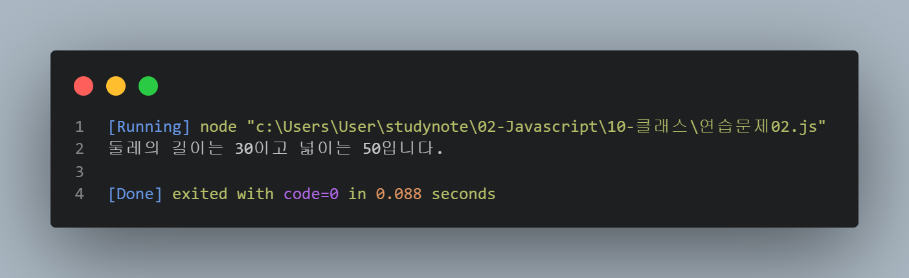
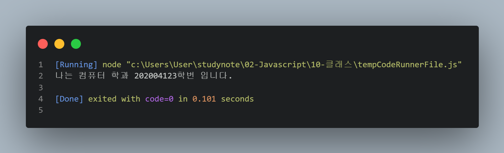
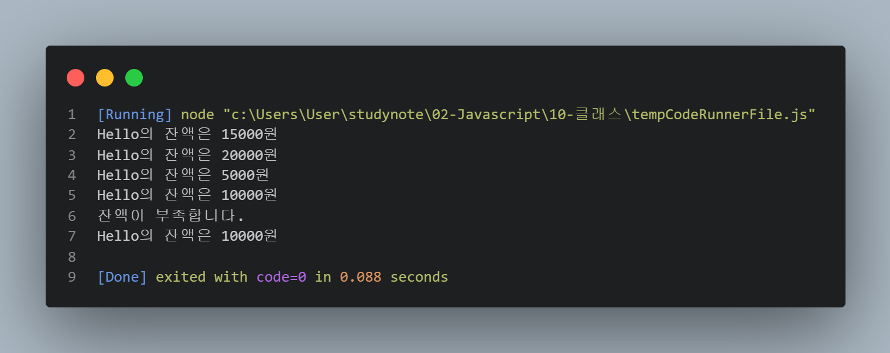

# Class 기반 객체지향 연습문제

> 2022-02-09

## 문제1.

앞 단원에서 수행한 연습문제 1,2번을 Class 기반의 객체지행으로 재구성하시오.

### 연습문제 1-1.

```js
class Student {
    constructor(kor, eng, math) {
        this._kor = kor;
        this._eng = eng;
        this._math = math;
    }

    sum() {
        return this._kor + this._eng + this._math;
    }

    avg() {
        return this.sum() / 3;
    }
}

const s1 = new Student(92, 81, 77);
const s2 = new Student(72, 95, 98);
const s3 = new Student(80, 86, 84);
console.log("철수의 총점은 %d점 이고 평균은 %d점 입니다.", s1.sum(), s1.avg());
console.log("영희의 총점은 %d점 이고 평균은 %d점 입니다.", s2.sum(), s2.avg());
console.log("민혁의 총점은 %d점 이고 평균은 %d점 입니다.", s3.sum(), s3.avg());
```


### 연습문제 1-2.

```js
class Rectangle {
    constructor () {
        this._width = null;
        this._height = null;
    }
    
    get width() {
        return this._width;
    }

    set width(param) {
        this._width = param;
    }

    get height() {
        return this._height;
    }

    set height(param) {
        this._height = param;
    }

    getAround () {
        return this.width * 2 + this.height * 2;
    }

    getArea () {
        return this.width * this.height
    }
}
const rect = new Rectangle();
rect.width = 10;
rect.height = 5;

console.log("둘레의 길이는 %d이고 넓이는 %d입니다.", rect.getAround(), rect.getArea());
```



> 2022-02-10

## 문제2.

다음을 만족하는 Student 클래스를 작성하시오.

1. String형의 학과와 정수형의 학번을 프로퍼티로로 선언후 생성자를 통해 주입
1. getter, setter를 정의
1. sayHello() 메서드를 통해 "나는 OOOO학과 OO학번 입니다." 를 출력하는 기능을 구현
2. 
```javascript
class Student {
    /** 생성자 */
    constructor(departName, departNumber) {
        // 학과이름
        this._departName = departName;
        // 학번
        this._departNumber = departNumber;
    }

    /** departName에 대한 getter */
    get departName() {
        return this._departName;
    }

    /** departName에 대한 setter */
    set departName(departName) {
        this._departName = departName;
    }

    /** departNumber에 대한 getter */
    get departNumber() {
        return this._departNumber;
    }

    /** departNumber에 대한 setter */
    set departNumber(departNumber) {
        this._departNumber = departNumber;
    }
    
    /** 메세지 출력 메서드 */
    sayHello() {
        console.log("나는 %s 학과 %s학번 입니다.", this.departName, this.departNumber);
    }
}


const stud = new Student("컴퓨터", 202004123);
stud.sayHello();
```



## 문제3.

다음을 만족하는 클래스 Account를 작성하시오.

1. 다음의 2 개의 필드를 선언
    - 문자열 owner; (이름)
    - 숫자형 balance; (금액)
1. 위 모든 필드에 대한 getter와 setter의 구현
1. 위 모든 필드를 사용하는 가능한 모든 생성자의 구현
1. 메소드 deposit()의 헤드는 다음과 같으며 인자인 금액을 저축하는 메소드
    - deposit(amount)
1. 메소드 withdraw()의 헤드는 다음과 같으며 인자인 금액을 인출(리턴)하는 메소드
    - withdraw(long amount)
    - 인출 상한 금액은 잔액까지로 하며, 이 경우 이러한 상황을 출력
    - 
```javascript
class Account {

    /** 생성자 */
    constructor(owner, balance) {
        // 문자열 owner; (이름)
        this._owner = owner;
        // 숫자형 balance; (금액)
        this._balance = balance;
    }

    get owner() {
        return this._owner;
    }

    set owner(param) {
        this._owner = param;
    }

    get balance() {
        return this._balance;
    }

    set balance(param) {
        this._balance = param;
    }

    // 인자인 금액을 저축하는 메소드
    deposit(amount) {
        this.balance += amount;
    }

    // 인자인 금액을 인출(리턴)하는 메소드
    withdraw(amount) {
        // 인출 상한 금액은 잔액까지로 하며, 이 경우 이러한 상황을 출력
        if (this.balance < amount) { 
            console.log("잔액이 부족합니다.");
            return;
        }
        this.balance -= amount;
        return amount;
    }
}

const acc = new Account("Hello", 15000);

//Hello의 잔액은 15000원
console.log("%s의 잔액은 %d원", acc.owner, acc.balance);

// ( 저축 ) Hello의 잔액은 20000원
acc.deposit(5000);
console.log("%s의 잔액은 %d원", acc.owner, acc.balance);

// ( 인출 ) Hello의 잔액은 5000원
acc.withdraw(15000);
console.log("%s의 잔액은 %d원", acc.owner, acc.balance);

// ( 저축 ) Hello의 잔액은 10000원
acc.deposit(5000);
console.log("%s의 잔액은 %d원", acc.owner, acc.balance);

// ( 인출 ) Hello의 잔액은 10000원
// 잔액이 부족합니다.
acc.withdraw(15000);
console.log("%s의 잔액은 %d원", acc.owner, acc.balance);
```
