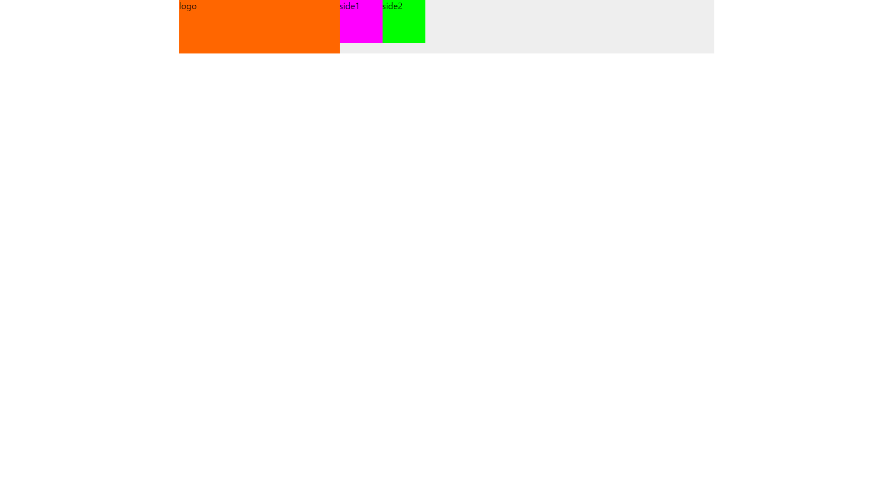
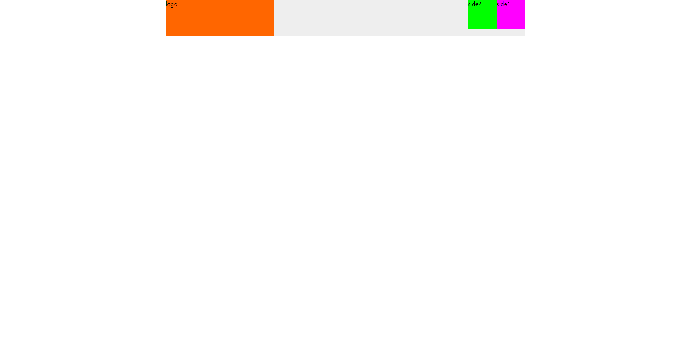
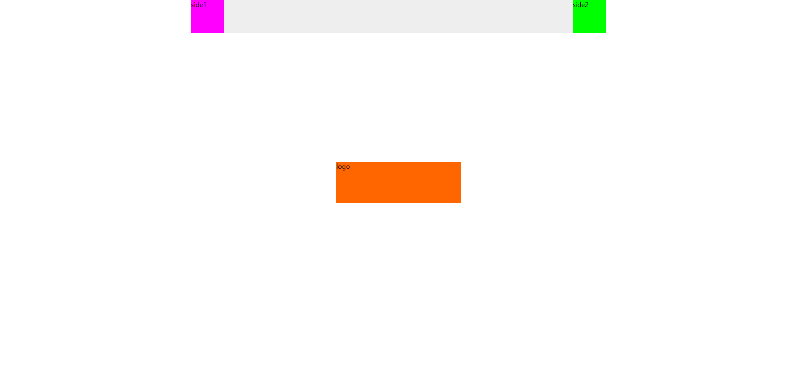
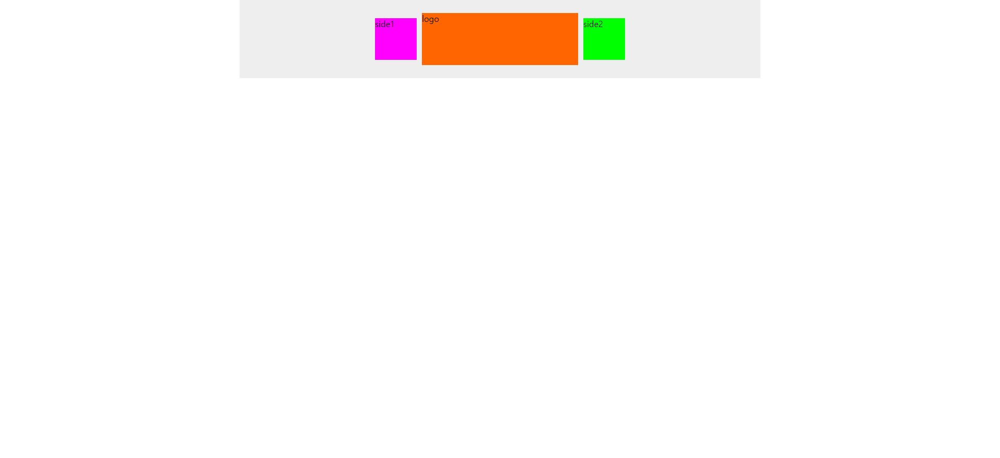
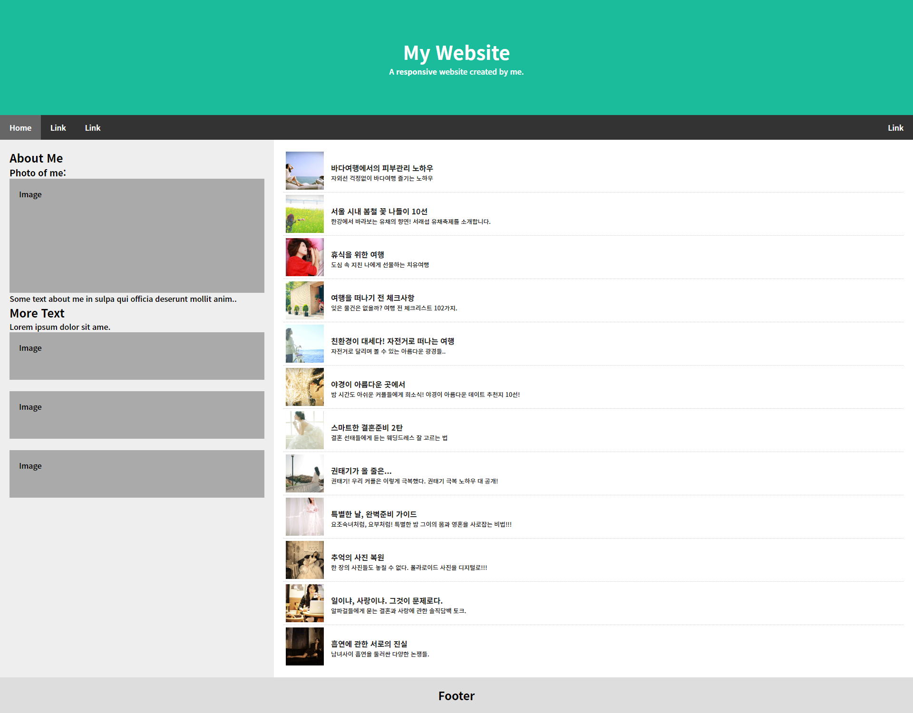

# 오현정 position과제

> 2022-03-07
## 공통(case) - common.css
```css
@charset "utf-8";

/* 공통 초기화 작업 */
* {
    padding:0;
    margin:0;
}

.text-center {
    text-align:center;
}

.text-right {
    text-align:right;
}

.text-left {
    text-align:left;
}

.inline {
    display:inline;
}

.inline-block {
    display:inline-block;
}

.pull-left {
    float:left;
}

.pull-right {
    float:right;
}

.clearfix:after {
    content:'';
    display:block;
    float:none;
    clear:both;
}
```


## case1
```html
<!DOCTYPE html>
<html lang="ko">
<head>
    <meta charset="UTF-8">
    <title>Document</title>
    <link rel="stylesheet" type="text/css" href="css/common.css" />
    <style>
        .container {
            width:1000px;
            margin:auto;
            background-color:#eee;
        }

        .logo {
            width:300px;
            height:100px;
            background-color:#ff6600;
        }

        .side1 {
            width:80px;
            height:80px;
            background-color:#ff00ff;
        }

        .side2 {
            width:80px;
            height:80px;
            background-color:#00ff00;
        }
    </style>
</head>
<body>
    <div class="container clearfix">
        <div class="logo pull-left">logo</div>
        <div class="side1 pull-left">side1</div>
        <div class="side2 pull-left">side2</div>
    </div>
</div>
</body>
</html>
```



## case2
```html
<!DOCTYPE html>
<html lang="ko">
<head>
    <meta charset="UTF-8">
    <title>Document</title>
    <link rel="stylesheet" type="text/css" href="css/common.css" />
    <style>
        .container {
            width: 1000px;
            background-color: #eee;
            margin: auto;
        }

        .logo {
            width: 300px;
            height: 100px;
            background-color: #ff6600;
        }

        .side1 {
            width: 80px;
            height: 80px;
            background-color: #ff00ff;
        }

        .side2 {
            width: 80px;
            height: 80px;
            background-color: #00ff00;
        }
    </style>
</head>
<body>
    <div class="container clearfix">
        <div class="logo pull-left">logo</div>
        <div class="side1 pull-right">side1</div>
        <div class="side2 pull-right">side2</div>
    </div>
</div>
</body>
</html>
```



## case3
```html
<!DOCTYPE html>
<html lang="ko">
<head>
    <meta charset="UTF-8">
    <title>Document</title>
    <link rel="stylesheet" type="text/css" href="css/common.css" />
    <style>
        .container {
            width:1000px;
            margin:auto;
            background-color:#eee;
        }

        .logo {
            /* (추가)절대좌표 방식 */
            position:absolute;
            /* (추가) box의 좌측 상단 꼭지점을 부모 중앙에 맞춤 */
            left:50%;
            top:50%;
            width: 300px;
            height: 100px;
            /* (추가) 스스로의 반만큼 반대로 이동 */
            margin-left:-150px;
            margin-top:-50px;
            background-color:#ff6600;
        }

        .side1 {
            width:80px;
            height:80px;
            background-color:#ff00ff;
        }

        .side2 {
            width:80px;
            height:80px;
            background-color:#00ff00;
        }
    </style>
</head>
<body>
    <div class="container clearfix">
        <div class="logo">logo</div>
        <div class="side1 pull-left">side1</div>
        <div class="side2 pull-right">side2</div>
    </div>
</div>
</body>
</html>
```



## case4
```html
<!DOCTYPE html>
<html lang="ko">
<head>
    <meta charset="UTF-8">
    <title>Document</title>
    <link rel="stylesheet" type="text/css" href="css/common.css" />
    <style>
        .container {
            /* (추가) .logo의 좌표 기준점 설정 */
            position:relative;
            width:1000px;
            height:150px;
            margin:auto;
            background-color:#eee;
        }

        .logo {
            position:absolute;
            left:50%;
            top:50%;
            width:300px;
            height:100px;
            margin-left:-150px;
            margin-top:-50px;
            background-color:#ff6600;
        }

        .side1 {
            /* (추가) */
            position:absolute;
            left:50%;
            top:50%;
            width:80px;
            height:80px;
            margin-left:-240px;
            margin-top:-40px;
            background-color:#ff00ff;
        }

        .side2 {
            /* (추가) */
            position:absolute;
            left:50%;
            top:50%;
            width:80px;
            height:80px;
            margin-left:160px;
            margin-top:-40px;
            background-color:#00ff00;
        }
    </style>
</head>
<body>
    <!-- float 사용 안함 -->
    <div class="container">
        <div class="logo">logo</div>
        <div class="side1">side1</div>
        <div class="side2">side2</div>
    </div>
</body>
</html>
```



## 카카오톡 전달 과제
```css
@charset "utf-8";

/* 공통 초기화 작업 */
* {
    padding:0;
    margin:0;
}

html,body {
    width:100%;
    height:100%;
}

ul, ol {
   list-style:none;
}

.header {
    padding:80px;
    background-color:#1abc9c;
    color:#fff;
    text-align:center;
}

.header h1 {
    font-size:40px;
}

.navbar {
    position:sticky;
    position:-webkit-sticky;
    top:0;
    background-color:#333;
    overflow:hidden;
}

.navbar a {
    display:block;
    float:left;
    padding:14px 20px;
    color:#fff;
    text-align:center;
    text-decoration:none;
}

.navbar a.right {
    float:right;
}

.navbar a:hover {
    background-color:#ddd;
    color:#000;
}

.navbar a.active {
    background-color:#666;
    color:#fff
}

.row {
    background-color:#eee;
}

.row:after {
    content:'';
    display:block;
    float:none;
    clear:both;
}

.side {
    float:left;
    width:30%;
}

.main {
    float:left;
    width:70%;
    background-color:#fff;
}
.container {
    padding:20px;
}

.container:last-child {
    border-left:1px soliod #d5d5d5;
}

.fakeimg {
    width:auto;
    padding:20px;
    background-color:#aaa;
}

#gallery > li {
    border-bottom:1px dotted #ccc;
}

#gallery > li:last-child {
    border-bottom:none;
}

#gallery > li > a {
    display:block;
    position:relative;
    width:auto;
    padding:5px;
    color:#222;
    text-decoration:none;
}

#gallery > li > a .thumb {
    display:block;
    width:80px;
    height:80px;
}
#gallery .thumb img {
    width:100%;
    height:100%;
}

#gallery .text {
    display:block;
    position:absolute;
    top:27px;
    left:100px;
    width:auto;
}

#gallery .text span {
    display:block;
    overflow:hidden;
    text-overflow:ellipsis;
    white-space:nowrap;
}

#gallery .text .title {
    font-weight:bold;
}
#gallery .text .desc {
    font-size:.8em;
    line-height:150%;
}

.footer {
    padding:20px;
    background-color:#ddd;
    text-align:center;
}
```
```html
<!DOCTYPE html>
<html lang="ko">
<head>
    <meta charset="UTF-8" />
    <meta name="viewport" content="width=device-width, initial-scale=1.0, minimum-scale=1.0, maximum-scale=1.0, user-scalable=no" />
    <title>Document</title>
    
    <link rel="preconnect" href="https://fonts.googleapis.com">
    <link rel="preconnect" href="https://fonts.gstatic.com" crossorigin>
    <link href="https://fonts.googleapis.com/css2?family=Noto+Sans+KR:wght@100;300;500;700&display=swap" rel="stylesheet">
    <!-- 외부 스타일시트 참조 -->
    <link  href="css/practice.css" type="text/css" rel="stylesheet" />
</head>
<body>
    <div class="header">
        <h1>My Website</h1>
        <p>A <b>responsive</b> website created by me.</p>
    </div>

    <div class="navbar">
        <a href="#" class="active">Home</a>
        <a href="#">Link</a>
        <a href="#">Link</a>
        <a href="#" class="right">Link</a>
    </div>

    <div class="row">
        <div class="side">
            <div class="container">
                <h2>About Me</h2>
                <h3>Photo of me:</h3>
                <div class="fakeimg" style="height:200px">Image</div>
                <p>Some text about me in sulpa qui officia deserunt mollit anim..</p>
                <h2>More Text</h2>
                <p>Lorem ipsum dolor sit ame.</p>
                <div class="fakeimg" style="height:60px">Image</div>
                <br />
                <div class="fakeimg" style="height:60px">Image</div>
                <br />
                <div class="fakeimg" style="height:60px">Image</div>
            </div>
        </div>
        <div class="main">
            <div class="container">
                <ul id="gallery">
                    <li>
                        <a href="#">
                            <span class="thumb">
                                
                            </span>
                            <span class="text">
                                <span class="title">바다여행에서의 피부관리 노하우</span>
                                <span class="desc">자외선 걱정없이 바다여행 즐기는 노하우</span>
                            </span>
                        </a>
                    </li>
                    <li>
                        <a href="#">
                            <span class="thumb">
                                
                            </span>
                            <span class="text">
                                <span class="title">서울 시내 봄철 꽃 나들이 10선</span>
                                <span class="desc">한강에서 바라보는 유채의 향연! 서래섭 유채축제를 소개합니다.</span>
                            </span>
                        </a>
                    </li>
                    <li>
                        <a href="#">
                            <span class="thumb">
                                
                            </span>
                            <span class="text">
                                <span class="title">휴식을 위한 여행</span>
                                <span class="desc">도심 속 지친 나에게 선물하는 치유여행</span>
                            </span>
                        </a>
                    </li>
                    <li>
                        <a href="#">
                            <span class="thumb">
                                
                            </span>
                            <span class="text">
                                <span class="title">여행을 떠나기 전 체크사항</span>
                                <span class="desc">잊은 물건은 없을까? 여행 전 체크리스트 102가지.</span>
                            </span>
                        </a>
                    </li>
                    <li>
                        <a href="#">
                            <span class="thumb">
                                
                            </span>
                            <span class="text">
                                <span class="title">친환경이 대세다! 자전거로 떠나는 여행</span>
                                <span class="desc">자전거로 달리며 볼 수 있는 아름다운 광경들..</span>
                            </span>
                        </a>
                    </li>
                    <li>
                        <a href="#">
                            <span class="thumb">
                                
                            </span>
                            <span class="text">
                                <span class="title">야경이 아름다운 곳에서</span>
                                <span class="desc">밤 시간도 아쉬운 커플들에게 희소식! 야경이 아름다운 데이트 추천지 10선!</span>
                            </span>
                        </a>
                    </li>
                    <li>
                        <a href="#">
                            <span class="thumb">
                                
                            </span>
                            <span class="text">
                                <span class="title">스마트한 결혼준비 2탄</span>
                                <span class="desc">결혼 선태들에게 듣는 웨딩드레스 잘 고르는 법</span>
                            </span>
                        </a>
                    </li>
                    <li>
                        <a href="#">
                            <span class="thumb">
                                
                            </span>
                            <span class="text">
                                <span class="title">권태기가 올 줄은...</span>
                                <span class="desc">권태기! 우리 커플은 이렇게 극복했다. 권태기 극복 노하우 대 공개!</span>
                            </span>
                        </a>
                    </li>
                    <li>
                        <a href="#">
                            <span class="thumb">
                                
                            </span>
                            <span class="text">
                                <span class="title">특별한 날, 완벽준비 가이드</span>
                                <span class="desc">요조숙녀처럼, 요부처럼! 특별한 밤 그이의 몸과 영혼을 사로잡는 비법!!!</span>
                            </span>
                        </a>
                    </li>
                    <li>
                        <a href="#">
                            <span class="thumb">
                                
                            </span>
                            <span class="text">
                                <span class="title">추억의 사진 복원</span>
                                <span class="desc">한 장의 사진들도 놓칠 수 없다. 폴라로이드 사진을 디지털로!!!</span>
                            </span>
                        </a>
                    </li>
                    <li>
                        <a href="#">
                            <span class="thumb">
                                
                            </span>
                            <span class="text">
                                <span class="title">일이냐, 사랑이냐. 그것이 문제로다.</span>
                                <span class="desc">알파걸들에게 묻는 결혼과 사랑에 관한 솔직담백 토크.</span>
                            </span>
                        </a>
                    </li>
                    <li>
                        <a href="#">
                            <span class="thumb">
                                
                            </span>
                            <span class="text">
                                <span class="title">흡연에 관한 서로의 진실</span>
                                <span class="desc">남녀사이 흡연을 둘러싼 다양한 논쟁들.</span>
                            </span>
                        </a>
                    </li>
                </ul>
            </div>
        </div>
    </div>

    <div class="footer">
        <h2>Footer</h2>
    </div>
</body>
</html>
```
